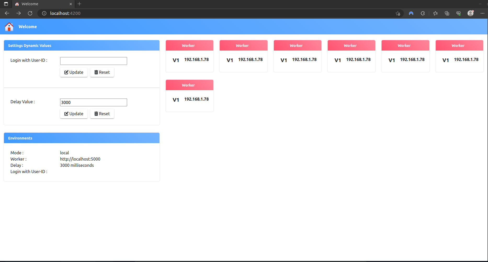

# NodeJS Microservices
# Stack
- NodeJS v18.14.1
- Mongo
- Minikube v1.29.0
- K8s v1.26.1
# Setup
## 1. Standalone
### Start a mongo server instance
```
docker run -d -p 27017:27017  mongo
```
### Worker
```
cd src/worker && npm i && npm start
```
### Front End
```
cd src/front-end && npm i && ng serve -c local
```
### Result

## 2. Docker Compose
### DB Init
```
cd docker-compose/db-init && docker build -t db-init:v1 .
```
### Worker
```
cd src/worker && docker build -t worker:v1 .
```
### Front End
```
cd src/front-end && ng build -c docker && docker build -t front-end:docker .
```
### Run Docker Compose
```
cd docker-compose && docker compose up
```
### Result

# K8s - Using Minikube
### Cluster
```
NAME       STATUS   ROLES           AGE   VERSION   INTERNAL-IP      EXTERNAL-IP   OS-IMAGE               KERNEL-VERSION   CONTAINER-RUNTIME
minikube   Ready    control-plane   1d    v1.26.1   192.168.56.100   <none>        Buildroot 2021.02.12   5.10.57          docker://20.10.23
```
### Create namespace
```
kubectl apply -f k8s/namespace/namespace.yml
```
### Deploy mongodb
```
kubectl apply -f k8s/db/deployment.yml
kubectl apply -f k8s/db/service.yml
```
### Deploy services
```
kubectl apply -f k8s/src/config.yml
kubectl apply -f k8s/src/deployment.yml
kubectl apply -f k8s/src/service.yml
kubectl apply -f k8s/src/ingress.yml
```
### Config local hostname
```
sudo vim /etc/hosts
```
Add at the end of file
```
192.168.56.100  worker.k8s.homelab.local
192.168.56.100  front-end.k8s.homelab.local
```
- 192.168.56.100 : Minikube IP
- worker.k8s.homelab.local : Worker hostname
- front-end.k8s.homelab.local : Front end hostname
### Result
